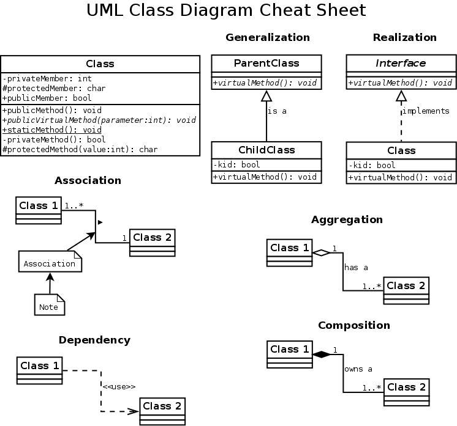

# Design Patterns

## UML Diagram Cheat Sheet



## Creational Patterns

### Abstract Factory


```swift
import Foundation

protocol AbstractProductOne {}

protocol AbstractProductTwo {}

protocol AbstractPlatform {
    func makeProductOne() -> AbstractProductOne
    func makeProductTwo() -> AbstractProductTwo
}

class ProductOnePlatformOne: AbstractProductOne {}

class ProductOnePlatformTwo: AbstractProductOne {}

class ProductTwoPlatformOne: AbstractProductTwo {}

class ProductTwoPlatformTwo: AbstractProductTwo {}

class PlatformOne: AbstractPlatform {
    func makeProductOne() -> AbstractProductOne {
        return ProductOnePlatformOne()
    }
    
    func makeProductTwo() -> AbstractProductTwo {
        return ProductTwoPlatformOne()
    }
}

class PlatformTwo: AbstractPlatform {
    func makeProductOne() -> AbstractProductOne {
        return ProductOnePlatformTwo()
    }
    
    func makeProductTwo() -> AbstractProductTwo {
        return ProductTwoPlatformTwo()
    }
}

class Class1 {
    func createProducts(for platform: AbstractPlatform) {
        platform.makeProductOne()
        platform.makeProductTwo()
    }
}

let platformOne = PlatformOne()
let platformTwo = PlatformTwo()

let class1 = Class1()
class1.createProducts(for: platformOne)
class1.createProducts(for: platformTwo)
```


### Builder

### Factory Method

### Prototype

### Singleton


```swift
class Singleton: NSObject {
    static let instance = Singleton()
    
    private override init() {}
}
```


## Structural Patterns

### Adapter

### Bridge

### Composite

### Decorator

### Facade

### Proxy


## Behavioral Patterns

### Chain of Responsiblity

### Command

### Iterator

### Mediator

### Momento

### Observer

### State

### Strategy

### Template

### Visitor


